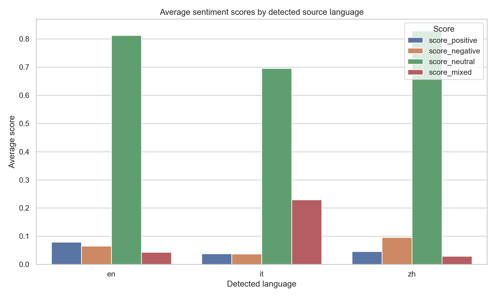
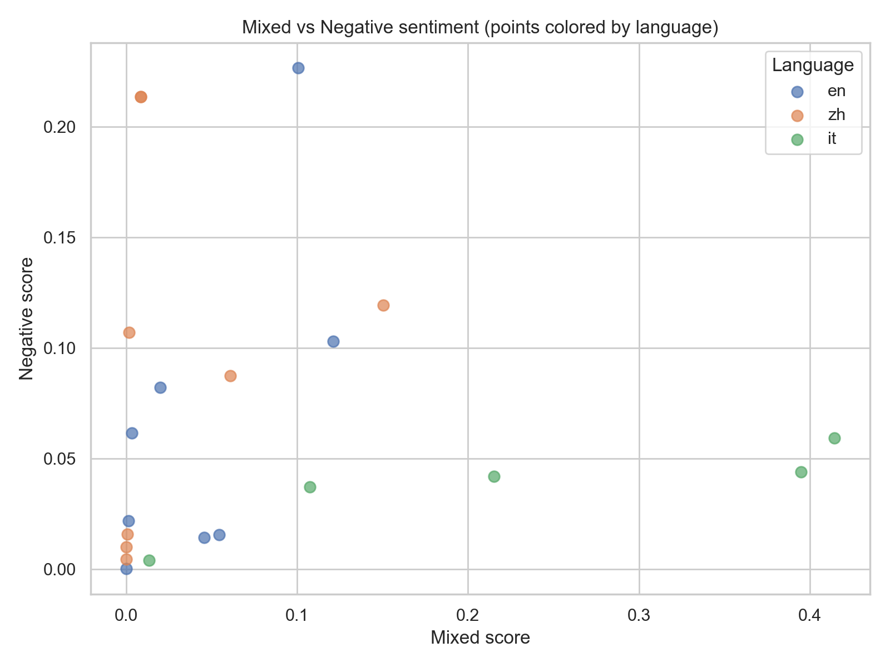
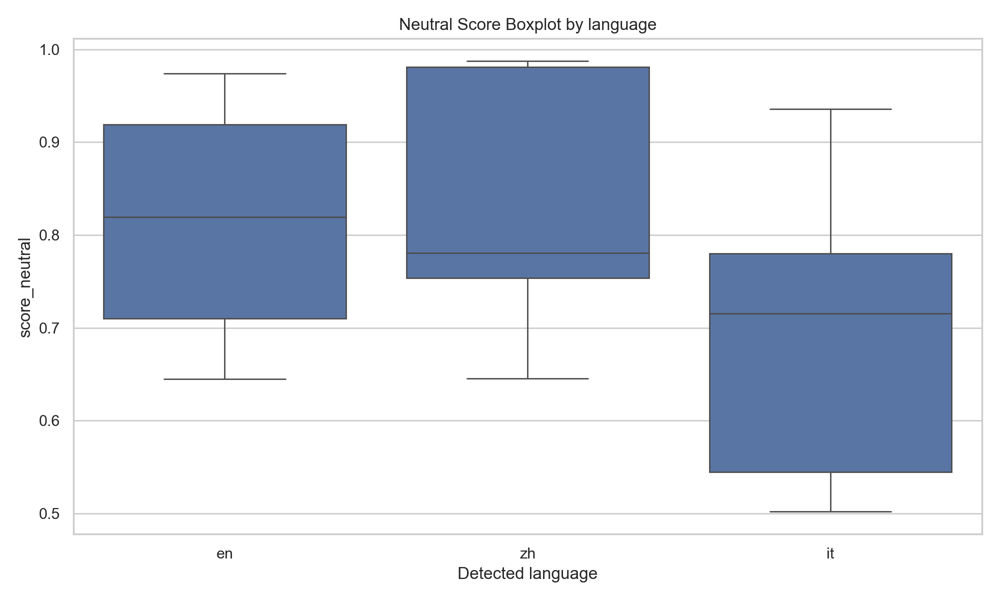

# Web Sentiment Pipeline

---

## Main work

Using the boto3 library to leverage the capabilities of AWS S3, Bedrock, Translate, and Comprehend to achieve the following workflow: inputting webpage URLs, with Bedrock scraping the webpage content, Translate translating it into English, Comprehend analyzing its sentiment, and the analysis results being stored in S3. This process can be used to analyze a large number of webpages.

## Basic Pipeline
1. Create S3 bucket: `ceu-jiaqi-2025 `
2. Configure AWS: `aws configure`
3. Create virtualenv and install: `python -m venv de_env && source de_env/bin/activate && pip install -r requirements.txt`
4. Run jupyter notebook de1assignment3.ipynb
5. Results saved to `s3://ceu-jiaqi-2025/results/`
6. Run jupyter notebook interpret_results.ipynb
7. Results saved to results_summary.csv and analysis_plots/

## Structure
```
DE1_assignment3/
├─ README.md
├─ requirements.txt
├─ .gitignore
├─ .env.sample               
├─ notebooks/
│  ├─ de1assignment3.ipynb
│  └─ interpret_results.ipynb
├─ analysis_plots/
│  ├─ mixed_boxplot.png
│  ├─ neutral_boxplot.png
│  ├─ Mixed_Negative_sentiment.png
│  ├─ Overall_sentiment.png
│  └─ avg_scores_by_lang.png
├─ results_json
└─ results_summary.csv

```

---

## Report - Comparing Sentiments in news across different languages

### 1. Research Question

In this assignment, we try to compare sentiments in news that were written in English, Chinese, and Italian. To reach this goal, we focus on the topic “Italian tennis world №1 Sinner tests positive for doping” to analyze emotional tendencies of English, Chinese, and Italian media.

### 2. Data Source

We randomly selected 30 webpages, that is 10 of each language, as the dataset of this research question:

**English webpages:**

https://www.independent.co.uk/sport/tennis/jannik-sinner-wimbledon-doping-case-explained-timeline-b2786961.html

https://www.nytimes.com/athletic/5806315/2025/05/05/jannik-sinner-doping-ban-case-tennis-explained/

https://www.bbc.com/sport/tennis/articles/cy5ny6lx5dqo

https://www.theguardian.com/sport/article/2024/aug/20/jannik-sinner-cleared-of-wrongdoing-failed-anti-doping-tests-tennis

https://insidersport.com/2025/02/17/sinner-banned-tennis-for-three-months/

https://www.reuters.com/sports/tennis/world-no-1-sinner-cleared-wrongdoing-after-failed-drug-tests-itia-says-2024-08-20/

https://timesofindia.indiatimes.com/sports/tennis/top-stories/jannik-sinner-cleared-of-wrongdoing-after-failed-drug-tests-itia-says/articleshow/112667044.cms

https://www.arise.tv/jannik-sinner-handed-three-month-ban-over-positive-drug-test/

https://www.abc.net.au/news/2025-01-11/jannik-sinner-doping-hearing-to-be-heard-in-april/104806806

https://www.npr.org/2025/02/15/nx-s1-5298666/tennis-top-ranked-jannik-sinner-gets-a-3-month-ban-in-doping-case-settlement

**Chinese webpages:**

https://news.cctv.com/2024/08/21/ARTIsGLdHATQw2Er1FhgNfGs240821.shtml

https://news.qq.com/rain/a/20240825A03C4300

http://www.xinhuanet.com/sports/20250216/c4e0ecacb41b46fe8e7db191765bc4d5/c.html

https://www.chinanews.com.cn/ty/2025/02-15/10369407.shtml

https://m.bjnews.com.cn/detail/1740022939129103.html

https://www.zaobao.com.sg/news/sports/story20250215-5883013

http://ent.people.com.cn/n1/2024/0822/c1012-40303768.html

https://xinwen.bjd.com.cn/content/s67b087abe4b08edd28f517e8.html

https://www.epochtimes.com/gb/25/2/15/n14438018.htm

https://www.163.com/dy/article/JA2RM1IB0549BAP0.html

**Italian webpages:**

https://www.eurosport.it/tennis/caso-doping-sinner-la-sentenza-spiegata-bene-le-date-i-dettagli-e-come-e-avvenuta-lassunzione-del-clostebol_sto20030540/story.shtml

https://www.rainews.it/articoli/2024/08/sport-tennis-atp-jannik-sinner-positivo-doping-in-aprile-assolto-per-assunzione-inconsapevole-8024a639-1822-4621-87a9-99381b443660.html

https://www.avvenire.it/agora/sport/positivo-al-doping-ma-innocente-lultima-disavventura-di-sinner_79977

https://www.corrieredellosport.it/news/tennis/sinner/2025/02/15-138430669/sinner_e_la_vicenda_doping_tutte_le_tappe_di_una_vicenda_infinita

https://www.corriere.it/sport/tennis/24_agosto_20/sinner-positivo-doping-scagionato-7ce25185-6154-4477-b303-1d701df58xlk.shtml

https://www.collegiosacrafamiglia.it/sinner-e-il-caso-doping/

https://www.today.it/sport/sinner-positivo-doping-allenatore-spray-fisioterapista-giacomo-naldi.html

https://www.fanpage.it/sport/tennis/sinner-positivo-due-volte-allantidoping-perche-e-innocente-la-ricostruzione-dellitia/

https://www.startmag.it/sanita/cose-la-sostanza-dopante-alla-quale-e-risultato-positivo-sinner/

https://www.tuttosport.com/news/tennis/2024/08/20-131691747/sinner_positivo_all_antidoping_ma_innocente_tutta_la_verita_sul_clostebol

*Note: When scraping those pages, 3 of them could not be extracted properly. So we actually used 27 of those pages.*

### 3. Research Method

To realize the research goal, we use 4 different AWS Serverless services in Python using the API, which are Bedrock, Translate, Comprehend and S3.

Here is the process how we worked with those pages:

- Web scraping: using the ‘request’ library for HTTP requests;

- Info cleaning: using Amazon Bedrock to clean and summarize the text scraped from pages；

- Translating: using Amazon Translate to translate all pages into English to ensure an unified baseline for the next step;

- Sentiments analysis: using Amazon Comprehend to detect emotional tendencies of those articles and give a comprehensive score;

- Storage: using Amazon S3 to store the results of the processes above.

### 4. Findings

Here we present 3 plots to show what we found in this assignment.

- **Column Chart: Sentiment scores of English, Italian and Chinese**



In this column chart, we can see that in general, Italian has the lowest neutral score but the highest mixed score. Chinese is the most negative about this topic, and English is the most positive.

- **Scatter Chart: Mixed vs. Negative Sentiment Scores by Language**



In this scatter chart, we can see that Italian tends to be more mixed and less negative. On the other hand, Chinese and English tend to be more negative and less mixed.

- **Box Plot: Distribution of Neutral Sentiment Scores by Language**



In this box plot, we can see that the median neutral score does not vary too much in three languages but tends to be a bit higher in Chinese and English. However, the overall distribution of neutral score is obviously lower in Italian.

In conclusion, the analysis results showed that Italian media were quite contradict when reporting their super star’s scandal, using both positive and negative words. International media who report in English were more positive regarding to this issue while Chinese media tended to criticized over that.

### 5. Cost Estimation

The cost estimation is based on such assumptions:

- we performed 2 rounds of testing before the final run;3 rounds in total;

- each Chinese page contains 1000 Chinese characters; 10 Chinese pages in total;

- each English and Italian page contain 1500 words; 10 English pages and 10 Italian pages in total.

- on average, each English word contain 6 characters; each Italian word contain 7 characters.

According to the assumptions, total data processed in the assignment could be computed:

Chinese pages: 10 pages* 1000 chars * 3 rounds= 30,000 chars;

English pages: 10 pages * (1500 words * 6 characters) * 3 rounds = 270,000 chars;

Italian pages: 10 pages * (1500 words * 7characters) * 3 rounds = 315,000 chars.

Then we can estimate the cost in each AWS service:

- Amazon Bedrock (Model: Mistral 7B Instruct):

30,000 Chinese chars ≈ 45k tokens;

45,000 English words ≈ 60k tokens;

45,000 Italian words ≈ 60k tokens.

Here we assume that inputs and outputs are equal in data amount.

Total cost = Input + Output = (45+60+60)*$0.00015 + (45+60+60)*$0.0002 ≈ $0.06

- Amazon Translate

We only translate Chinese and Italian into English.

(30,000 + 315,000)/1,000,000 * $15 = $5.175

- Amazon Comprehend

We assume that after translation, Chinese chars expands 1.5 times.

(30,000*1.5 + 270,000 + 315,000)/100 * $0.0001 = $0.63

- d.Amazon S3

The cost of S3 could be ignored since the amount of data is only hundreds kilobyte.

So the final estimate of cost should be: $0.06+$5.175+$0.63+$0.00=$5.865.

